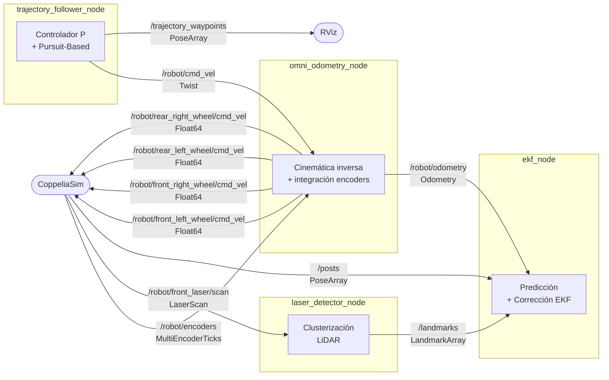
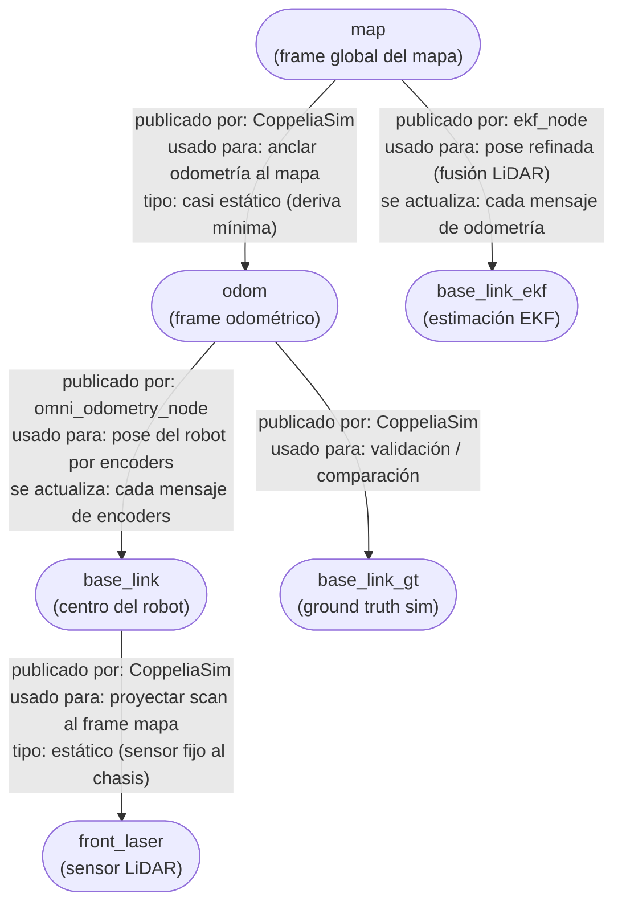

# Diagramas del sistema

## 1. Nodos y tópicos



---

## 2. Árbol de transformaciones TF



---

## 3. Quién lee cada transformación y para qué

| Transform | Lo publica | Lo lee | Para qué |
|-----------|-----------|--------|----------|
| `map → odom` | CoppeliaSim | TF Buffer (automático) | Eslabón que conecta los dos árboles |
| `odom → base_link` | `omni_odometry_node` | `trajectory_follower_node` (indirectamente vía `map→base_link`) | Pose odométrica del robot |
| `map → base_link_ekf` | `ekf_node` | `trajectory_follower_node` (feedback de control) | Pose corregida con LiDAR para el controlador P |
| `odom → base_link_gt` | CoppeliaSim | RViz (solo visualización) | Ground truth para validar odometría y EKF |
| `base_link → front_laser` | CoppeliaSim | `ekf_node` (implícito en modelo h(x)) | Posición del sensor en el chasis |

### Cómo se compone `map → base_link`

El Buffer de TF2 nunca recibe ese transform directamente.
Lo reconstruye concatenando dos transforms que sí existen:

```
map → base_link  =  (map → odom)  ∘  (odom → base_link)
                      [sim]              [omni_odometry_node]
```

Esto es lo que `lookupTransform("map", "base_link", ...)` devuelve internamente,
y es lo que `trajectory_follower_node` usaría si el feedback fuera odometría pura.

Con EKF activo, el follower pide `map → base_link_ekf` directamente —
no hay composición porque ese transform va directo de `map`.
