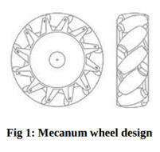
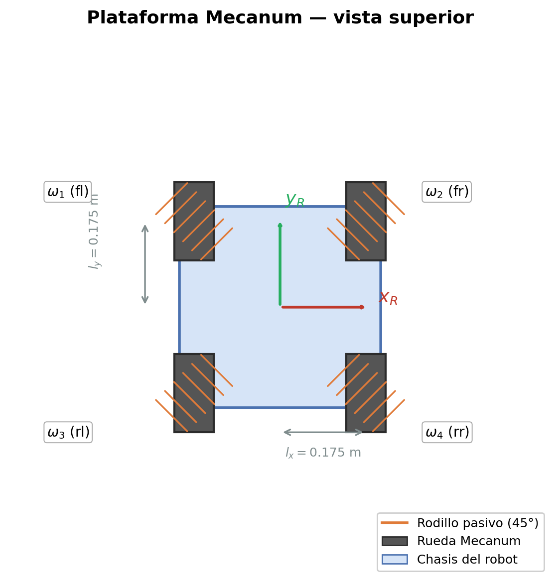
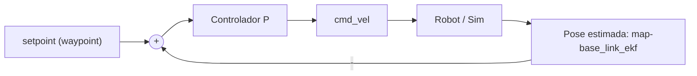
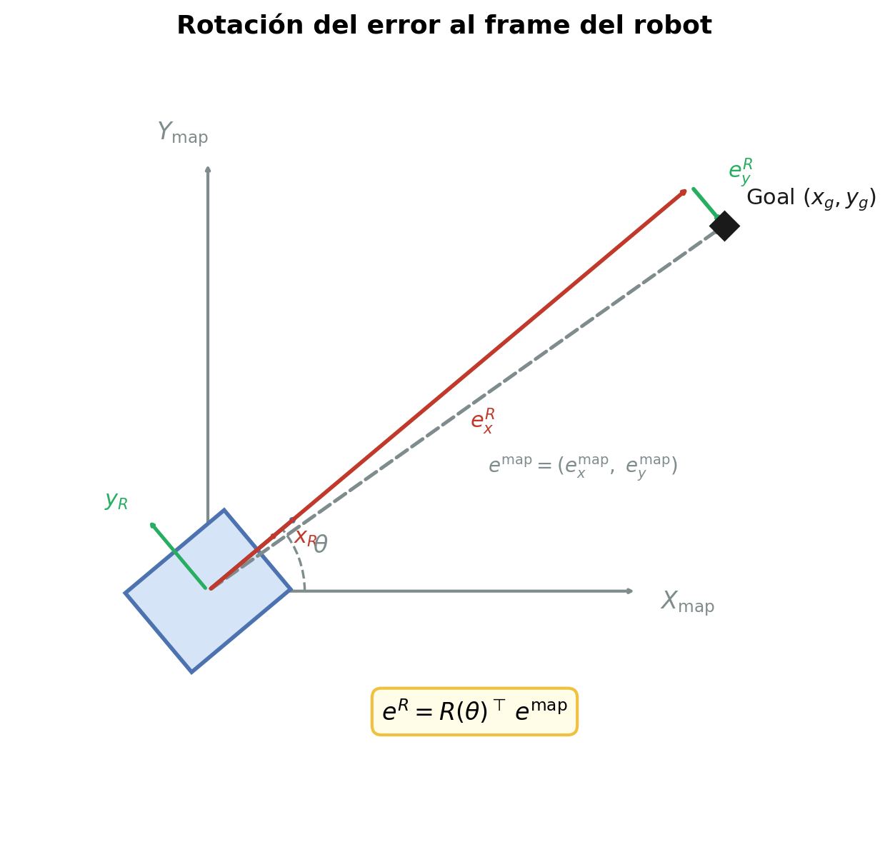
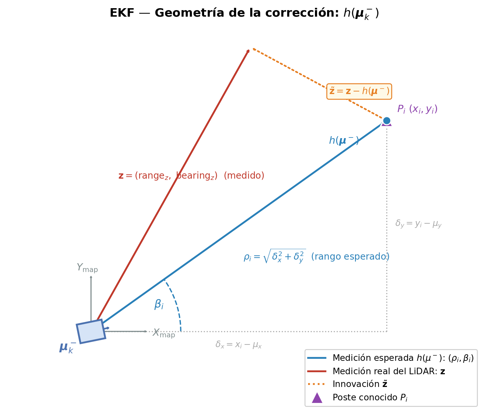
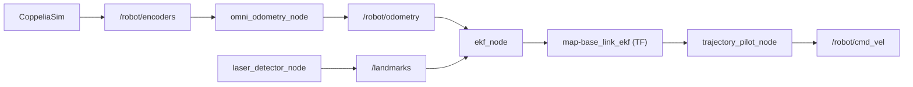
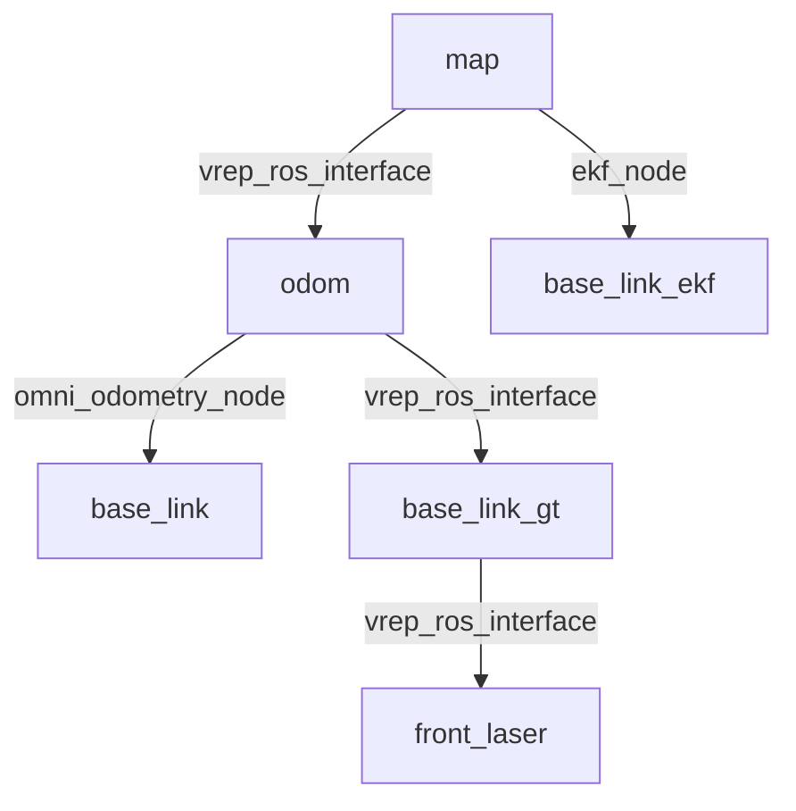

# Informe

## Introducción

El problema que aborda el trabajo es el desarrollo de una estructura de paquetes en ROS2 para la localización y movimiento de un robot ominidireccional utilizando la odometría de [Taheri et al. (2015)](Paper.pdf), sensores LiDAR y el filtro extendido de Kalman.

Los robots omnidireccionales tienen la particularidad de tener *ruedas Mecanum* que les permiten la traslación en cualquier dirección y rotar simultáneamente sin necesidad de reorientarse. 



En este trabajo, el robot modelo que usamos, al cual de ahora en más llamaremos **plataforma**, tiene las siguientes especificaciones:

| Parámetro               | Símbolo | Valor                   |     |
| ----------------------- | ------- | ----------------------- | --- |
| Radio de la rueda       | $r$     | $0.05\ \text{m}$        |     |
| Mitad del largo (eje X) | $l_x$   | $0.175\ \text{m}$       |     |
| Mitad del ancho (eje Y) | $l_y$   | $0.175\ \text{m}$       |     |
| Resolución del encoder  | —       | $500\ \text{ticks/rev}$ |     |




## Modelo cinemático de un robot omnidireccional

La cinemática estudia la descripción del movimiento de un robot móvil sin estudiar las causas que lo originan. Se busca modelarlo como una serie de orientaciones y posiciones en el tiempo, la cual denominamos pose. Una pose esta referenciada a un marco de referencia (`map`, `odom`, `base_link`, ...), el cual se compone de un origen $O_i$ y una base de vectores ortonormales.

Se distingue entre dos tipos de cinemáticas:

> Observación: Las velocidades $v_*$ están medidas respecto al frame del robot.

### Cinemática inversa

Traduce la velocidad deseada del robot en la velocidad correspondiente de los actuadores.

**En este caso:** sería traducir comandos de velocidad `Twist` $\begin{bmatrix}
v_x \\
v_y \\
\omega_z
\end{bmatrix} \in \mathbb{V}$ a velocidades angulares de cada rueda $\begin{bmatrix} 
\omega_\text{fl} \\ 
\omega_\text{fr} \\ 
\omega_\text{rl} \\
\omega_\text{rr}
\end{bmatrix} \in \mathbb{W}$.

[Taheri et al. (2015)](Paper.pdf) define la siguiente transformación: 

$$T: \mathbb{V} \rightarrow \mathbb{W}, \quad \mathbf{w} = T\mathbf{v}$$

$$\begin{bmatrix} 
\omega_\text{fl} \\ 
\omega_\text{fr} \\ 
\omega_\text{rl} \\
\omega_\text{rr}
\end{bmatrix}
=
\frac{1}{r} \begin{bmatrix}
1 & -1 & -(l_x+l_y) \\
1 & 1 & (l_x+l_y) \\
1 & 1 & -(l_x+l_y) \\
1 & -1 & (l_x+l_y)
\end{bmatrix}
\begin{bmatrix}
v_x \\
v_y \\
\omega_z
\end{bmatrix}$$

- $T \in \mathbb{R}^{4\times3}$, 
- $\mathbf{v} = [v_x,\ v_y,\ \omega_z]^\top \in \mathbb{V}$ son las velocidades longitudinal, transversal y angular de la plataforma
- $\omega_i \in \mathbb{W}$ son las velocidades angulares de las ruedas en rad/s.

### Cinemática directa

Traduce las velocidades de los actuadores en la velocidad del robot.

**En este caso:** sería traducir las velocidades medidas a partir de los encoders de las ruedas a la velocidad de la plataforma.

$$T^+: \mathbb{W} \rightarrow \mathbb{V}, \quad \mathbf{v} = T^+ \mathbf{w}$$

Esta es la transformación inversa de $T$. Luego, como $T \in \mathbb{R}^{4\times3}$ no es cuadrada ($\not \exists T^{-1}$), se usa la pseudoinversa de Moore-Penrose $T^+ = (T^\top T)^{-1}T^\top \in \mathbb{R}^{3\times4}$. Luego queda definida la transfromación como:

$$\begin{bmatrix}
v_x \\
v_y \\
\omega_z
\end{bmatrix}
=
\frac{r}{4}
\begin{bmatrix}
1 & 1 & 1 & 1 \\
-1 & 1 & 1 & -1 \\
\frac{-1}{l_x+l_y} & \frac{1}{l_x+l_y} & \frac{-1}{l_x+l_y} & \frac{1}{l_x+l_y}
\end{bmatrix}
\begin{bmatrix}
\omega_\text{fl} \\
\omega_\text{fr} \\
\omega_\text{rl} \\
\omega_\text{rr}
\end{bmatrix}$$

### Estimación odométrica

Podemos utilizar el desplazamiento de las ruedas medido por los encoders para estimar la pose de la plataforma en el frame `odom`.

> **Notación:** 
> - Nombraremos al marco `map` (coordenadas de la simulación) como M, `odom` (desplazamiento desde el inicio del robot) como O, `base_link` (frame del robot) como $R$. 
> - $^i\mathbf{p} = (x, y, \theta)^\top$ es la pose del robot (posición + orientación) en el marco de referencia $i$.

Sea $^O\mathbf{p}_k = (x_k, y_k, \theta_k)^\top$ la pose estimada en `odom` al instante $k$. Los desplazamientos $(^R\Delta x, ^R\Delta y, ^R\Delta\theta)$ están expresados en el **frame del robot** (R), por lo que hay que rotar la parte de traslación al frame `odom` antes de integrar. La integración de Euler deja un $^Op_{k+1}$ definido por:

$$^O\mathbf{p}_{k+1} = {}^O\mathbf{p}_k + \begin{bmatrix} \cos\theta_k & -\sin\theta_k & 0 \\ \sin\theta_k & \cos\theta_k & 0 \\ 0 & 0 & 1 \end{bmatrix} \begin{bmatrix} ^R\Delta x \\ ^R\Delta y \\ ^R\Delta\theta \end{bmatrix}$$

donde el bloque superior izquierdo $R(\theta_k) = \begin{bmatrix}\cos\theta_k & -\sin\theta_k \\ \sin\theta_k & \cos\theta_k\end{bmatrix}$ rota los desplazamientos de traslación del frame del robot al frame `odom`, y la última fila integra la orientación directamente.

Para calcular $(^R\Delta x, ^R\Delta y, ^R\Delta\theta)$, los encoders acumulan ticks absolutos. En cada período se computa el desplazamiento lineal incremental de cada rueda:

$$\Delta d_i = \Delta\text{ticks}_i \cdot \frac{2\pi r}{500}$$

Como $T^+$ es lineal, la misma relación que mapea velocidades angulares $\omega_i$ a velocidades de la plataforma aplica para desplazamientos pues $\omega_i = \frac{\Delta \phi_i}{\Delta t}$. Basta sustituir $\omega_i \to \Delta\phi_i = \Delta d_i/r$ (desplazamiento angular incremental de cada rueda). 
Luego, desarrollando $T^+[\Delta\phi_i]$ y cancelando el factor $r$:

$$\begin{bmatrix}^R\Delta x \\ ^R\Delta y \\ ^R\Delta\theta\end{bmatrix}
= T^+\begin{bmatrix}\Delta\phi_{fl} \\ \Delta\phi_{fr} \\ \Delta\phi_{rl} \\ \Delta\phi_{rr}\end{bmatrix}
= \frac{1}{4}\begin{bmatrix}
1 & 1 & 1 & 1 \\
-1 & 1 & 1 & -1 \\
\dfrac{-1}{l_x+l_y} & \dfrac{1}{l_x+l_y} & \dfrac{-1}{l_x+l_y} & \dfrac{1}{l_x+l_y}
\end{bmatrix}
\begin{bmatrix}\Delta d_{fl} \\ \Delta d_{fr} \\ \Delta d_{rl} \\ \Delta d_{rr}\end{bmatrix}$$

La pose $^O\mathbf{p}_k$ se publica como la transformación `odom → base_link`.

### Experimentación

> #### 1. **Validación de cinemática inversa:** 
> TODO: Enviar consignas de velocidad constante para cada grado de libertad por separado ($v_x$ puro, $v_y$ puro, $\omega_z$ puro) y comparar las velocidades angulares comandadas a cada rueda contra las velocidades reales reportadas por el simulador.

> #### 2. **Validación de odometría:** 
> Se movió el robot en trayectorias simples conocidas (traslación pura en X, traslación pura en Y, rotación en el lugar) y se comparó la pose estimada por odometría (`odom → base_link`) contra el ground truth provisto por CoppeliaSim (`odom → base_link_gt`). Como se observa en los videos, la odometría acumula error con la distancia recorrida debido a la integración de Euler y a imperfecciones del modelo.

<figure>
  <iframe class="video-demo" src="https://drive.google.com/file/d/1zihTPNzXgV-jO1oe3W9y3CFOTLDDNq9y/preview" width="640" height="360" allow="autoplay"></iframe>
  <p class="video-fallback">Video: Movimiento en X sin EKF — <a href="https://drive.google.com/file/d/1zihTPNzXgV-jO1oe3W9y3CFOTLDDNq9y/view?usp=sharing">ver en Google Drive</a></p>
  <figcaption>Traslación pura en X: odometría (<code>base_link</code>) vs. ground truth (<code>base_link_gt</code>).</figcaption>
</figure>

<figure>
  <iframe class="video-demo" src="https://drive.google.com/file/d/1VhgZSVhULc5Tdv54so55UMRfWXCDRimh/preview" width="640" height="360" allow="autoplay"></iframe>
  <p class="video-fallback">Video: Movimiento en Y sin EKF — <a href="https://drive.google.com/file/d/1VhgZSVhULc5Tdv54so55UMRfWXCDRimh/view?usp=sharing">ver en Google Drive</a></p>
  <figcaption>Traslación pura en Y: odometría (<code>base_link</code>) vs. ground truth (<code>base_link_gt</code>).</figcaption>
</figure>

<figure>
  <iframe class="video-demo" src="https://drive.google.com/file/d/15kUvZ78t_TzNmAoFXn7Wk8LJ9NnTNi_G/preview" width="640" height="360" allow="autoplay"></iframe>
  <p class="video-fallback">Video: Rotación en Z sin EKF — <a href="https://drive.google.com/file/d/15kUvZ78t_TzNmAoFXn7Wk8LJ9NnTNi_G/view?usp=sharing">ver en Google Drive</a></p>
  <figcaption>Rotación pura en Z: odometría (<code>base_link</code>) vs. ground truth (<code>base_link_gt</code>).</figcaption>
</figure>


## Control a lazo cerrado y seguimiento de trayectorias

Para que el robot siga una trayectoria de manera autónoma se implementó un controlador Proporcional (P) independiente para cada uno de los tres grados de libertad del robot omnidireccional: traslación longitudinal ($v_x$), traslación transversal ($v_y$) y rotación ($\omega_z$).

### Lazo abierto vs. lazo cerrado

En un esquema de **lazo abierto**, el robot ejecutaría una secuencia de velocidades precalculadas sin observar su posición real. Cualquier perturbación (deslizamiento de rueda, error de modelo) acumularía deriva sin posibilidad de corrección. 

Por otra parte, un esquema de **lazo cerrado** retroalimenta la pose estimada del robot en cada ciclo de control y corrige el comando de velocidad en función de cuánto falta para llegar al objetivo. En este caso el cuánto es el error de la pose estimada por odometría o ekf versus el waypoint goal. 

El diagrama de lazo cerrado es el siguiente:



### Controlador proporcional

Dado que el robot es holonómico, los tres grados de libertad pueden controlarse de forma desacoplada. En cada iteración del lazo de control se obtiene la pose actual del robot $\mathbf{p} = (x, y, \theta)$ desde la transformación `odom → base_link` (o `odom → base_link_ekf` cuando se utiliza EKF), y se computa el error respecto del waypoint objetivo $\mathbf{g} = (x_g, y_g, \theta_g)$:

$$e_{x}^{\text{map}} = x_g - x, \qquad e_{y}^{\text{map}} = y_g - y, \qquad e_\theta = \theta_g - \theta$$

Luego en base a estos errores, si no pasan la [tolerancia](#selección-de-waypoint-pursuit-based), se computan las velocidades necesarias para alcanzar $g$ como:

$$v_x = k_{p,x} \cdot e_x^R, \qquad v_y = k_{p,y} \cdot e_y^R, \qquad \omega_z = k_{p,\theta} \cdot \text{norm(}e_\theta)$$

El error de orientación se normaliza al rango $(-\pi, \pi]$ para evitar discontinuidades:

$$\text{norm(}e_\theta) = \text{atan2}(\sin(e_\theta),\, \cos(e_\theta))$$

Esta normalización es esencial: sin ella, pasar de $\theta = \pi - \varepsilon$ a $\theta = -\pi + \varepsilon$ generaría un error aparente de casi $2\pi$ que produciría un giro completo innecesario.

> **Observación**
> 
> La cinemática inversa (sección anterior) traduce velocidades en el **frame del robot** a velocidades de rueda. Por lo tanto, el controlador debe producir comandos $v_x, v_y, \omega_z$ expresados en ese mismo frame. Sin embargo, la pose estimada y el waypoint objetivo están ambos expresados en el frame inercial `map`.
> 
> Si se comanda directamente $v_x^{\text{map}} = k_p \cdot e_x^{\text{map}}$, el robot interpretaría ese valor como "avanzar en mi eje longitudinal", que **no coincide** con el norte del mapa salvo cuando $\theta = 0$. El resultado sería una trayectoria incorrecta que varía con la orientación del robot.
> 
> La solución es rotar el vector de error al frame del robot antes de multiplicar por la ganancia. La rotación inversa $R(\theta)^\top$ deshace la orientación del robot:
> 
> $$\begin{bmatrix} e_x^R \\ e_y^R \end{bmatrix}
> = R(\theta)^\top \begin{bmatrix} e_x^{\text{map}} \\ e_y^{\text{map}} \end{bmatrix}
> = \begin{bmatrix} \cos\theta & \sin\theta \\ -\sin\theta & \cos\theta \end{bmatrix}
> \begin{bmatrix} e_x^{\text{map}} \\ e_y^{\text{map}} \end{bmatrix}$$
> 



### Trayectoria cuadrada

La trayectoria conspreestablecida para testear consiste en un cuadrado de 2 metros de lado centrado en el origen. Las esquinas se recorren en sentido antihorario: $(2{,}-2) \to (2{,}2) \to (-2{,}2) \to (-2{,}-2)$. Para cada lado se generan 20 waypoints intermedios equidistantes, totalizando 80 waypoints. La orientación de cada waypoint es "opuesta al centro", es decir $\theta_i = \text{atan2}(y_i, x_i)$, lo que hace que el robot apunte radialmente hacia afuera del cuadrado durante todo el recorrido.

<!--TODO  -->

### Selección de waypoint (Pursuit-Based)

El robot avanza al siguiente waypoint cuando se satisfacen simultáneamente dos condiciones:

$$\sqrt{(e_x^{\text{map}})^2 + (e_y^{\text{map}})^2} < \varepsilon_{\text{pos}} \qquad \land \qquad |e_\theta| < \varepsilon_\theta$$

Siendo $\varepsilon_{\text{pos}}, \varepsilon_\theta$ parámetros a experimentar.

### Constantes del controlador

Las ganancias del controlador son parámetros de ROS2 sintonizables sin recompilar:

| Parámetro | Símbolo | Valor default |
|---|---|---|
| Ganancia longitudinal | $k_{p,x}$ | $1{,}0$ |
| Ganancia transversal | $k_{p,y}$ | $1{,}0$ |
| Ganancia angular | $k_{p,\theta}$ | $1{,}0$ |

### Experimentación

> #### 1. Selección de $\varepsilon_{\text{pos}}, \varepsilon_\theta$ 
> TODO:

> #### 2. Selección de $k_{p,*}$ 
> TODO:

## Localización basada en EKF

Para refinar la estimación de la posición el trabajo utiliza el filtro extendido de Kalman (EKF). La odometría acumula error con la distancia recorrida debido a la integración de Euler y a las imperfecciones del modelo cinemático. El EKF fusiona la predicción odométrica con observaciones de postes conocidos detectados por el LiDAR, obteniendo una estimación más robusta de la pose en el frame `map`.

### Concepto

El Filtro de Kalman Extendido (EKF) es una extensión del filtro de Kalman para sistemas no lineales. Mantiene una estimación gaussiana del estado del robot representada por la media $\boldsymbol{\mu}$ y la covarianza $\boldsymbol{\Sigma}$. El ciclo se divide en dos etapas:

- **Predicción:** dado el modelo de movimiento $f(\mathbf{x}, \mathbf{u})$ y la entrada de control $\mathbf{u}$, se propaga la estimación hacia adelante y se aumenta la incertidumbre.
- **Corrección:** para cada landmark observado, se computa la innovación entre la medición esperada $h(\mathbf{x})$ y la medición real $\mathbf{z}$, y se aplica la ganancia de Kalman para reducir la incertidumbre.

La no linealidad se linealiza localmente mediante los Jacobianos $F = \nabla_x f$ y $H = \nabla_x h$.

### Aplicación

#### Estado, entradas y mediciones

El estado del filtro es la pose del robot en el frame `map`:

$$\boldsymbol{\mu} = \begin{bmatrix} x \\ y \\ \theta \end{bmatrix}$$

La covarianza $\boldsymbol{\Sigma} \in \mathbb{R}^{3\times3}$ es una matriz simétrica definida positiva que cuantifica la incertidumbre del filtro: sus diagonales $(\sigma_x^2,\, \sigma_y^2,\, \sigma_\theta^2)$ representan la varianza de cada coordenada. Como el simulador posiciona al robot en una pose conocida al inicio, se puede asumir incertidumbre muy baja. La implementación inicializa $\boldsymbol{\Sigma}_0 = 0{,}01 \cdot I_3$.

La entrada de control son las velocidades del robot en su propio frame, obtenidas del tópico `/robot/odometry`:

$$\mathbf{u} = \begin{bmatrix} v_x \\ v_y \\ \omega \end{bmatrix}$$

La medición de cada landmark detectado es el rango y el bearing desde el robot:

$$\mathbf{z} = \begin{bmatrix} \text{range} \\ \text{bearing} \end{bmatrix}$$

#### Etapa de predicción

Ante cada mensaje de odometría, el filtro propaga el estado hacia adelante usando el modelo de movimiento $f(\mathbf{x}, \mathbf{u})$, que integra las velocidades al frame inercial mediante Euler:

$$\boldsymbol{\mu}_k^- = f(\boldsymbol{\mu}_{k-1}, \mathbf{u}_k) = \boldsymbol{\mu}_{k-1} + \begin{bmatrix} (v_x \cos\theta - v_y \sin\theta)\,\Delta t \\ (v_x \sin\theta + v_y \cos\theta)\,\Delta t \\ \omega\,\Delta t \end{bmatrix}$$

La no linealidad se linealiza con el Jacobiano $F = \nabla_x f$ evaluado en $\boldsymbol{\mu}_{k-1}$:

$$F = \begin{bmatrix} 1 & 0 & (-v_x\sin\theta - v_y\cos\theta)\Delta t \\ 0 & 1 & (v_x\cos\theta - v_y\sin\theta)\Delta t \\ 0 & 0 & 1 \end{bmatrix}$$

La covarianza se propaga aumentando la incertidumbre con el ruido de proceso $Q$:

$$\boldsymbol{\Sigma}_k^- = F\,\boldsymbol{\Sigma}_{k-1}\,F^\top + Q$$

donde $Q$ modela la incertidumbre acumulada por la odometría en cada paso de integración:

$$Q = \begin{bmatrix} (0{,}05)^2 & 0 & 0 \\ 0 & (0{,}05)^2 & 0 \\ 0 & 0 & (2°\text{ en rad})^2 \end{bmatrix}$$

> **Observación: ¿Por qué Q la definimos así?**
>
> $Q$ es la covarianza del **ruido de proceso**: modela la incertidumbre que el modelo de movimiento agrega en cada paso de integración. Formalmente, en el modelo EKF el estado evoluciona como $x_t = f(u_t, x_{t-1}) + w_t$ con $w_t \sim \mathcal{N}(0, Q)$. En cada predicción esta incertidumbre se acumula: $\Sigma_k^- = F\Sigma_{k-1}F^\top + Q$, por lo que $Q$ cuantifica cuánto crece la incertidumbre del filtro cuando no hay correcciones del sensor.
>
> **Origen de los valores:**
> - $\sigma_x = \sigma_y = 0{,}05\,\text{m}$: el radio de la rueda es $r = 0{,}05\,\text{m}$. Usar $\sigma = r$ por paso de integración refleja que el error de posición ante deslizamiento e imperfecciones del modelo Mecanum es del orden del radio, que es la escala natural de imprecisión cinemática del sistema.
> - $\sigma_\theta = 2°$: el error angular del modelo Mecanum proviene de las imperfecciones en las velocidades diagonales de las ruedas. $2°$ por paso es un margen conservador sobre la incertidumbre de la integración de Euler de la velocidad angular estimada.
>
> Si $Q$ fuera mucho menor, la ganancia de Kalman $K = \Sigma^- H^\top S^{-1}$ sería pequeña y las correcciones del LiDAR apenas afectarían la estimación. Si fuera mucho mayor, la covarianza crecería rápidamente y cualquier detección (incluso ruidosa) produciría correcciones agresivas.

#### Etapa de corrección

Ante cada mensaje de `/landmarks`, el filtro incorpora las observaciones del LiDAR. Para cada centroide detectado se ejecutan cuatro pasos en secuencia.



**Paso 1 — Asociación de datos**

El detector de postes publica centroides en el frame `base_link`, pero no sabe a qué poste del mapa corresponde cada uno. La asociación resuelve esa correspondencia: para cada centroide medido $\mathbf{z} = (\text{range}_z,\, \text{bearing}_z)$ se itera sobre los postes conocidos del mapa y se calcula qué mediría el sensor si el robot estuviera en $\boldsymbol{\mu}_k^-$:

$$\text{score}(i) = \bigl|\text{range}_z - \rho_i\bigr| + \bigl|\text{bearing}_z - \beta_i\bigr|$$

$\rho_i = \sqrt{\delta_{x,i}^2 + \delta_{y,i}^2}$, $\beta_i = \text{atan2}(\delta_{y,i},\, \delta_{x,i}) - \theta$ son el rango y bearing esperados al poste $i$ ($P_i$) desde el estado predicho ($\delta_{x,i} = P_{i,x} - \mu_x$, $\delta_{y,i} = P_{i,y} - \mu_y$). El poste asociado es el $P_i$ que minimiza

$$i^* = \arg\min_i\ \text{score}(i)$$

**Paso 2 — Medición esperada e innovación**

La medición esperada $h(\boldsymbol{\mu}_k^-)$ es precisamente el par $(\rho_{i^*},\, \beta_{i^*})$ ya calculado en el paso anterior para el poste $i^*$. Representa la posición estimada para $P_i$ desde $\mu$. 
$$h(\boldsymbol{\mu}_k^-) = \begin{bmatrix} \rho_{i^*} \\ \beta_{i^*} \end{bmatrix}$$

La **innovación** es la discrepancia entre lo medido y lo esperado:

$$\tilde{\mathbf{z}}_k = \mathbf{z}_k - h(\boldsymbol{\mu}_k^-) = \begin{bmatrix} \text{range}_z - \rho_{i^*} \\ \text{bearing}_z - \beta_{i^*} \end{bmatrix}$$

El bearing de la innovación se normaliza a $(-\pi, \pi]$ para evitar discontinuidades angulares. Si la innovación es cero, el LiDAR confirma exactamente la pose predicha; si es grande, hay corrección.

La no linealidad de $h$ se linealiza con el Jacobiano evaluado en $\boldsymbol{\mu}_k^-$:

$$H = \frac{\partial h}{\partial \mathbf{x}}\bigg|_{\boldsymbol{\mu}_k^-} = \begin{bmatrix} -\delta_{x,i^*}/\rho_{i^*} & -\delta_{y,i^*}/\rho_{i^*} & 0 \\ \delta_{y,i^*}/\rho_{i^*}^2 & -\delta_{x,i^*}/\rho_{i^*}^2 & -1 \end{bmatrix}$$

La primera fila es el gradiente del rango respecto de $(x, y, \theta)$: mover el robot en la dirección del poste reduce el rango, moverlo perpendicularmente no lo cambia. La segunda fila es el gradiente del bearing: el tercer elemento es $-1$ porque aumentar $\theta$ reduce el bearing relativo.

**Paso 3 — Ganancia de Kalman**

La ganancia $K_k$ balancea la confianza en el estado predicho versus la confianza en el sensor:

$$S_k = H\,\boldsymbol{\Sigma}_k^-\,H^\top + R \qquad \in \mathbb{R}^{2\times2}$$

$$K_k = \boldsymbol{\Sigma}_k^-\,H^\top\,S_k^{-1} \qquad \in \mathbb{R}^{3\times2}$$

$S_k$ es la covarianza de la innovación: combina la incertidumbre del estado proyectada al espacio de medición ($H\,\boldsymbol{\Sigma}_k^-\,H^\top$) con el ruido del sensor ($R$). $K_k$ es grande cuando $\boldsymbol{\Sigma}_k^-$ es grande (mucha incertidumbre del estado → confiar en el sensor) y pequeño cuando $R$ es grande (sensor poco confiable → confiar en la predicción).

donde $R$ modela el error del sensor LiDAR al estimar rango y bearing:

$$R = \begin{bmatrix} (0{,}1)^2 & 0 \\ 0 & (5°\text{ en rad})^2 \end{bmatrix}$$

> **Observación: ¿Por qué R la definimos así?**
>
> $R$ es la covarianza del **ruido de medición**: modela el error del sensor al estimar $[\text{range}, \text{bearing}]$ de cada poste detectado ($v_t \sim \mathcal{N}(0, R)$ en $z_t = h(x_t) + v_t$). Aparece en la covarianza de la innovación $S = H\Sigma^- H^\top + R$: cuanto mayor es $R$, menor es la ganancia de Kalman y menos peso tienen las correcciones del sensor sobre el estado predicho.
>
> **Origen de los valores:**
> - $\sigma_{\text{range}} = 0{,}1\,\text{m}$: el detector de postes estima el centroide de un arco de puntos LiDAR sobre un cilindro de diámetro nominal $0{,}1\,\text{m}$. El centroide del arco (cuerda) se desplaza respecto del centro real del cilindro hasta $\approx d/2 = 0{,}05\,\text{m}$; con las imperfecciones del clustering se usa $0{,}1\,\text{m}$ como margen conservador.
> - $\sigma_{\text{bearing}} = 5°$: a una distancia típica de detección de $\sim\!1{,}5\,\text{m}$, la tolerancia de clustering `POST_TOL = 0.08 m` puede desplazar el centroide hasta $0{,}08\,\text{m}$ lateralmente, lo que corresponde a un error angular de $\arctan(0{,}08 / 1{,}5) \approx 3°$. Considerando además la cuantización angular del LiDAR, se usa $5°$ como margen.
>
> Si $R$ fuera mucho menor, detecciones ruidosas producirían saltos bruscos en la pose estimada; si fuera mucho mayor, el filtro ignoraría las correcciones del LiDAR y la estimación degeneraría en odometría pura.
>
> La relación entre $Q$ y $R$ determina el balance del filtro. Con $Q_x = Q_y = (0{,}05)^2 = 0{,}0025\,\text{m}^2/\text{paso}$ y $R_{\text{range}} = (0{,}1)^2 = 0{,}01\,\text{m}^2$, el sensor es más ruidoso que el modelo por paso individual. Sin embargo, $Q$ se acumula en cada integración sin corrección: pasados aproximadamente $4$ pasos sin detectar postes, la incertidumbre acumulada en posición alcanza el nivel del ruido del sensor y las correcciones del LiDAR adquieren peso significativo. Esto produce el comportamiento deseado: el filtro sigue la odometría entre observaciones y corrige con el sensor cuando detecta postes.

**Paso 4 — Actualización de estado y covarianza**

$$\boldsymbol{\mu}_k = \boldsymbol{\mu}_k^- + K_k\,\tilde{\mathbf{z}}_k$$

$$\boldsymbol{\Sigma}_k = (I - K_k H)\,\boldsymbol{\Sigma}_k^-$$

$K_k \in \mathbb{R}^{3\times2}$ proyecta la innovación bidimensional (rango, bearing) sobre las tres coordenadas de estado, distribuyendo la corrección según la geometría de $H$ y las incertidumbres relativas. La covarianza resultante $\boldsymbol{\Sigma}_k$ es necesariamente menor que $\boldsymbol{\Sigma}_k^-$: cada observación reduce la incertidumbre. Si se detectan varios postes en el mismo ciclo, los pasos 1–4 se repiten secuencialmente, cada corrección usando la $\boldsymbol{\mu}$ y $\boldsymbol{\Sigma}$ actualizadas por la anterior.

### Experimentación: Seguimiento de trayectorias a lazo cerrado utilizando localización basada en EKF

El sistema completo integra el seguimiento de trayectorias del ítem 2 con la localización por EKF del ítem 3. La única modificación al nodo de seguimiento es la fuente de pose utilizada como feedback: en lugar de la transformación `map → base_link` (odometría pura), se usa `map → base_link_ekf` (pose estimada por el EKF).

Esto se controla en tiempo de compilación mediante la macro `USE_EKF` en [trajectory_pilot.cpp](modelo_omnidireccional/src/trajectory_pilot.cpp):

```cpp
#if USE_EKF
    static constexpr const char* kOdomFrame = "base_link_ekf";
#else
    static constexpr const char* kOdomFrame = "base_link";
#endif
```

De este modo el controlador P recibe como referencia la pose corregida por el EKF, cerrando el lazo de control con una estimación más precisa que la odometría pura. El flujo completo es:



### Experimentación 
> #### 1. Matplotlib: Comparar poses con ground truth para velocidades constantes.
> TODO

> #### 2. RVIZ2: Elipsoide de covarianza en el recorrido.
> TODO

## Sistema desarrollado

El sistema se implementó como un paquete de ROS2 (`modelo_omnidireccional`) con cuatro nodos independientes. Todos los nodos corren dentro de un contenedor Docker que monta el código fuente como volumen.

### Nodos y tópicos

| Nodo | Ejecutable | Descripción |
|---|---|---|
| `omni_odometry` | `omni_odometry_node` | Cinemática directa/inversa y odometría |
| `laser_detector` | `laser_detector_node` | Detección de postes por LiDAR |
| `ekf_localizer` | `ekf_node` | Localización por EKF |
| `trajectory_pilot` | `trajectory_follower_node` | Seguimiento de trayectoria cuadrada |

#### Tópicos suscritos

| Tópico | Tipo | Nodo suscriptor |
|---|---|---|
| `/robot/cmd_vel` | `geometry_msgs/Twist` | `omni_odometry_node` |
| `/robot/encoders` | `robmovil_msgs/MultiEncoderTicks` | `omni_odometry_node` |
| `/robot/front_laser/scan` | `sensor_msgs/LaserScan` | `laser_detector_node` |
| `/robot/odometry` | `nav_msgs/Odometry` | `ekf_node` |
| `/landmarks` | `robmovil_msgs/LandmarkArray` | `ekf_node` |
| `/posts` | `geometry_msgs/PoseArray` | `ekf_node` |

#### Tópicos publicados

| Tópico | Tipo | Nodo publicador |
|---|---|---|
| `/robot/front_left_wheel/cmd_vel` | `std_msgs/Float64` | `omni_odometry_node` |
| `/robot/front_right_wheel/cmd_vel` | `std_msgs/Float64` | `omni_odometry_node` |
| `/robot/rear_left_wheel/cmd_vel` | `std_msgs/Float64` | `omni_odometry_node` |
| `/robot/rear_right_wheel/cmd_vel` | `std_msgs/Float64` | `omni_odometry_node` |
| `/robot/odometry` | `nav_msgs/Odometry` | `omni_odometry_node` |
| `/landmarks` | `robmovil_msgs/LandmarkArray` | `laser_detector_node` |
| `/robot/cmd_vel` | `geometry_msgs/Twist` | `trajectory_pilot_node` |
| `/trajectory_waypoints` | `geometry_msgs/PoseArray` | `trajectory_pilot_node` |

### Transformaciones (TF tree)



- `map → odom`: publicada por CoppeliaSim con la posición inicial del robot.
- `odom → base_link`: publicada por `omni_odometry_node` con la pose integrada por odometría.
- `odom → base_link_gt`: ground truth del simulador, solo para depuración.
- `base_link → front_laser`: pose fija del sensor LiDAR relativa al robot, publicada por CoppeliaSim.
- `map → base_link_ekf`: pose estimada por el EKF, publicada por `ekf_node`.

### Instrucciones para ejecutar

```bash
# Terminal 1 — simulación
coppeliaSim /root/coppeliaSim/omni_ekf.ttt  

# Terminal 2 — odometría + cinemática inversa
ros2 run modelo_omnidireccional omni_odometry_node

# Terminal 3 — detector de landmarks
ros2 run modelo_omnidireccional laser_detector_node

# Terminal 4 — EKF
ros2 run modelo_omnidireccional ekf_node

# Terminal 5 — seguimiento de trayectoria
ros2 run modelo_omnidireccional trajectory_follower_node \
  --ros-args -p kp_x:=1.0 -p kp_y:=1.0 -p kp_theta:=1.5 \
             -p position_tolerance:=0.1 -p angle_tolerance:=0.15
```

> Además, para facilitar el testeo disponibilizamos un script que utiliza `tmux` para abrir múltiples consolas a la vez y ejecutar los nodos rápidamente: `./script/lauch_terminator.sh` (ejecutar fuera del container).

## Conclusiones

El trabajo permitió implementar un sistema funcional de localización y seguimiento de trayectorias para un robot omnidireccional Mecanum en ROS2 + CoppeliaSim. Los principales resultados obtenidos son:

- **Modelo cinemático:** la implementación de la cinemática inversa (Taheri et al., ec. 20) y directa (ec. 22–24) permite controlar con precisión las velocidades del robot y estimar su pose mediante odometría. Como era esperable, el error odométrico se acumula con la distancia recorrida debido a la integración de Euler y a las imperfecciones del modelo (deslizamiento, fricción).

- **Localización EKF:** la fusión de odometría y landmarks LiDAR mediante EKF reduce significativamente la deriva acumulada. La configuración de matrices $Q$ y $R$ refleja una mayor confianza en el sensor que en el modelo de movimiento, lo que resulta en correcciones efectivas cuando se detectan postes.

- **Sistema integrado:** el seguimiento de trayectorias usando la pose estimada por EKF como feedback mejora la precisión del recorrido respecto al uso de odometría pura, especialmente en trayectorias largas donde el error acumulado de la odometría se vuelve significativo.
